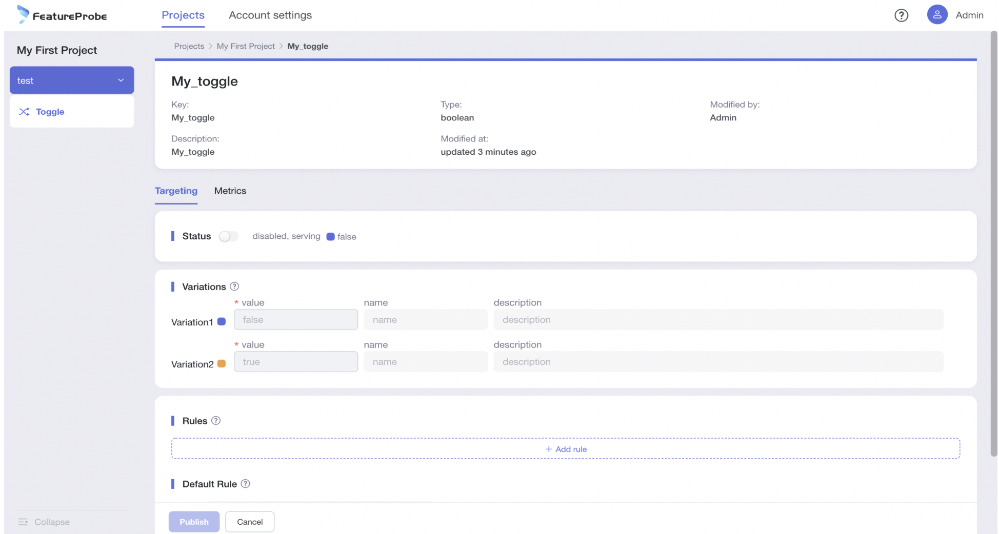
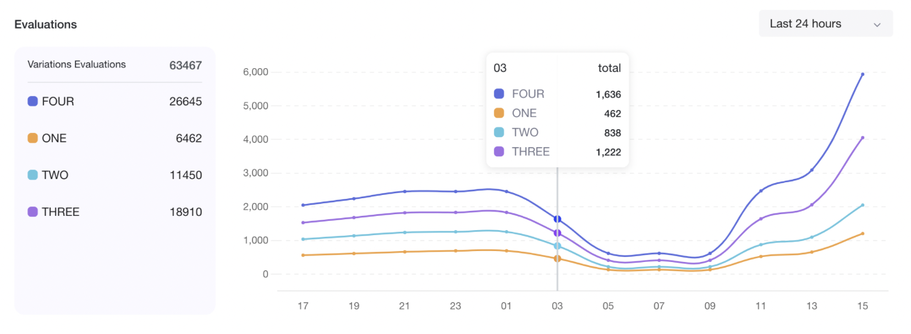

# 使用功能开关

## 使用功能开关
FeatureProbe平台提供了强大的功能开关管理模块，功能开关通过选择目标流量，进行功能投放，通过持续观测数据逐步放量直到全量部署。
### 开关仪表盘

1. 默认展示My First Project的online环境的开关列表信息
2. 左侧导航栏提供了快速切换环境的入口（点击环境右侧的下拉icon）
3. 通过筛选条件，我们可以根据"evaluated","enabled/disabled","tags","name/key/description"对开关进行快速的筛选

### 添加开关模板
开关的“模板信息”（开关创建成功后，将同步成为已有环境的初始化信息）

1. 填写开关名称
2. 填写开关的key（开关的唯一性标识，同项目下唯一，一旦创建不可编辑）
3. 填写描述信息
4. 选择标签（无初始值，可自行创建）
5. 选择sdk类型
6. 选择开关的return type（支持4种：Boolean、String、Number、JSON），一旦创建不可编辑
7. 填写Variations
    - 默认两个variations，value为空（最少2个，可自行增减）【value可更改，name可更改，description可更改】

8. 填写disabled return value（开关禁用时的返回值），默认同步variation1的数据，可更改
9. 点击创建按钮，完成开关的创建

### 编辑开关模板
开关的“模板信息”（编辑成功后，不会影响已有环境中的开关配置信息，仅同步到未来新环境的初始化信息）

### 开关配置
开关的“配置信息”（各环境间不共享，独立拥有,修改配置信息，不会同步到开关的"模板信息"），请切换到目标环境后，再进行配置（配置信息的初始信息，会自动同步开关的“模板信息”）

1. Status：开关的状态（禁用后生效Disabled return value，启用后开关配置中的Rules及Default Rule生效）
2. Variations：默认同步开关的模板信息（可更改）
3. Rules：多个Rule之间为“或”关系（rule的顺序很重要，一个用户进来，是从上往下依次筛选的，命中了第一个Rule就不会再匹配下面的Rule，没命中的才会继续往下筛）

  - 添加Rule：为“指定人群”设置“返回值”
 
    + 填写rule名称
    + 根据“条件”筛选“指定人群”，条件之间为且的关系（至少有一个条件）
      * 添加条件：选择用户属性（自定义添加，回车生效）、选择关系符、填写具体的值（自定义添加，回车生效）
      * 删除条件：点击条件行右侧的删除icon，即可删除该条件
    + 指定返回值：在variations中选择【可以选择某一个variation（该项占比100%），也可以每个variation指定百分比（所有的variation占比之和必须为100%）】
    + 点击Rule卡片区域并拖动，可以对rule进行自由排序
    + 删除Rule卡片：点击卡片右上角删除icon即可删除整条Rule

4. 设置Default Rule：为“未指定人群”设置默认返回值：在variations中选择【可以选择某一个variation（该项占比100%），也可以每个variation指定百分比（所有的variation占比之和必须为100%）】
5. Disabled return value：默认同步开关的模板信息（可更改）
6. 点击Publish，展示更改前后的diff信息，且支持填写【变更说明】（回显在历史版本中）
7. 点击confirm，完成发布

### 连接SDK
便于用户简单、高效的接入我们的SDK、明确知悉接入状态【图片】

1. 步骤1：选择目标语言的SDK，点击【保存并继续】
2. 步骤2：根据SDK生成代码行，可以快速复制到代码中，点击【继续】
3. 步骤3：测试应用接入情况，返回接入结果。

### 查看历史版本
支持查看功能配置变更的完整历程【图片】

### 查看开关的访问信息
支持查看Variation【name】、【value】两个维度的访问数据（各环境间独立）

1. 统计信息：展示筛选时间段内每个Variation的总访问量
2. 统计粒度：目前默认展示24小时内的访问信息，点击可切换查看7天内的访问信息
3. 变更记录：每次【版本变更】都会展示变更标签（一个时间粒度内多次变更会合并展示一个变更标志），点击可跳转到对应的开关版本中，方便用户感知版本变更对访问数据的影响
