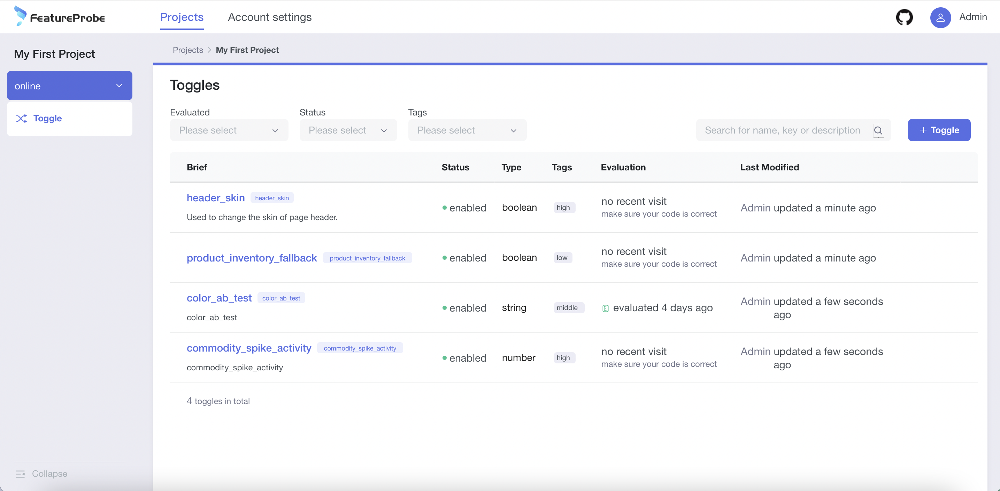
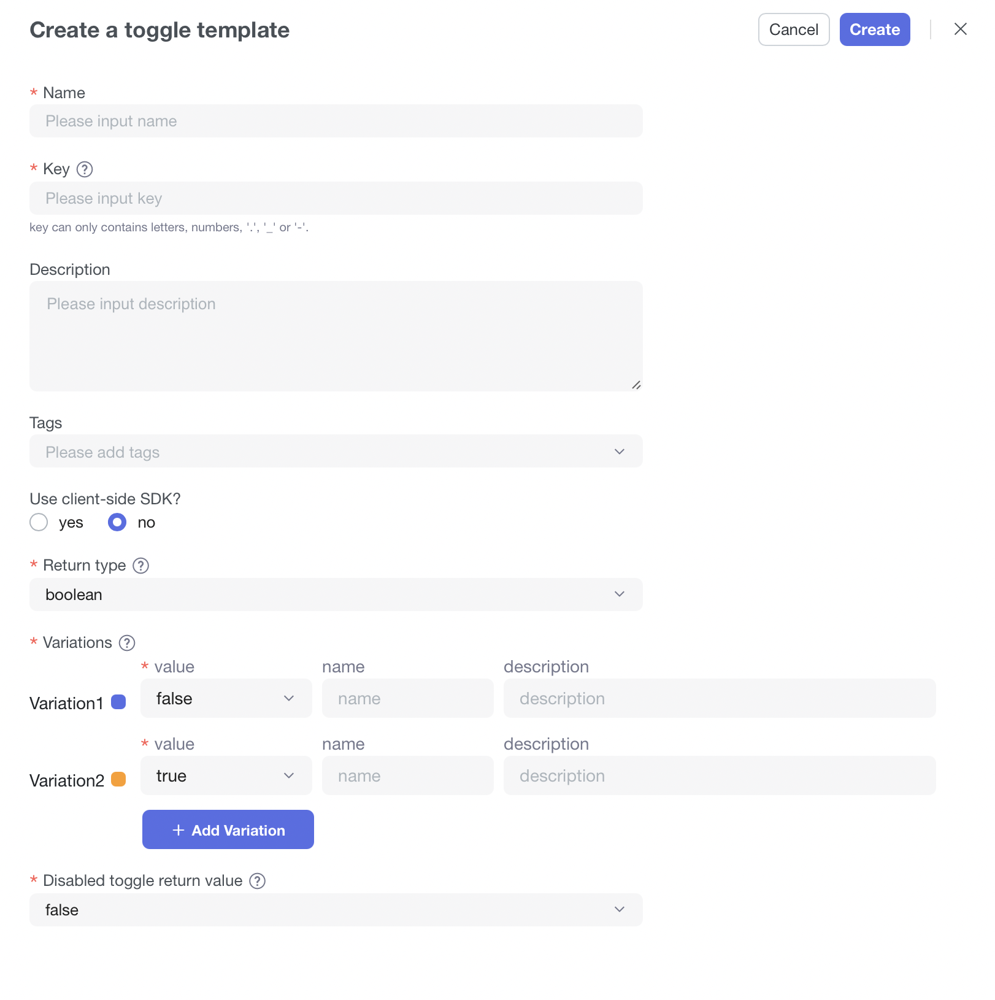

# 使用功能开关

## 使用功能开关
FeatureProbe平台提供了强大的功能开关管理模块，功能开关通过选择目标流量，进行功能投放，通过持续观测数据逐步放量直到全量部署。
### 开关仪表盘

1. 默认展示My First Project的online环境的开关列表信息
2. 左侧导航栏提供了快速切换环境的入口（点击环境右侧的下拉icon）
3. 通过筛选条件，我们可以根据"evaluated","enabled/disabled","tags","name/key/description"对开关进行快速的筛选

### 添加开关模板
开关的“模板信息”（开关创建成功后，将同步成为已有环境的初始化信息）

1. 填写开关名称
2. 填写开关的key（开关的唯一性标识，同项目下唯一，一旦创建不可编辑）
3. 填写描述信息
4. 选择标签（无初始值，可自行创建）
5. 选择sdk类型
6. 选择开关的return type（支持4种：Boolean、String、Number、JSON），一旦创建不可编辑
7. 填写Variations
    - 默认两个variations，value为空（最少2个，可自行增减）【value可更改，name可更改，description可更改】

8. 填写disabled return value（开关禁用时的返回值），默认同步variation1的数据，可更改
9. 点击创建按钮，完成开关的创建

### 编辑开关模板
开关的“模板信息”（编辑成功后，不会影响已有环境中的开关配置信息，仅同步到未来新环境的初始化信息）

