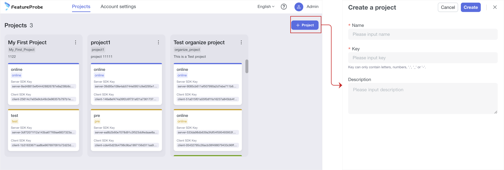
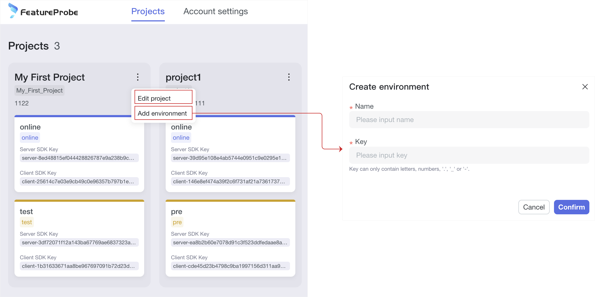
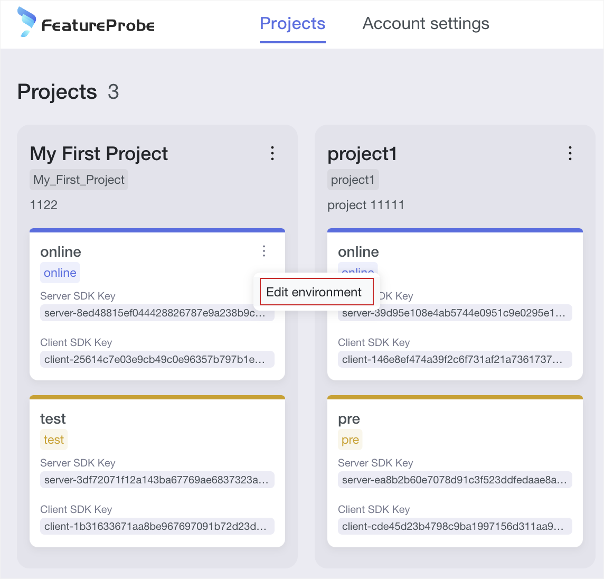

# How to use project and environment

## Project Management
Projects allow one FeatureProbe account to manage multiple different business goals. Generally a project corresponds to a system platform. For example, you can create a project called "Mobile Application" and another project called "Server Application". Each project has its own unique environment and corresponding functional toggles. You can create multiple environments in each project, all projects must have at least one environment
The system will have an initial project (My First Project) with 2 environments (test, online) each with its own SDK key to connect the FeatureProbe SDK to the specific environment.
### Add project

1. Click "Projects" in the top menu to enter the project list page
2. Click the Add Project button
3. fill in the project name
4. fill in the key (the project's unique identifier, once created, cannot be edited)
5. Fill in the description
6. Click the Create button to complete the creation of the project (once the project is created, it cannot be deleted. The newly created project will come with an online environment)
7. Click the environment card under the project to go directly to the list of toggles for that environment under the project

### Edit project

1. Click Edit Project Icon
2. Edit the project information
3. Click the Save button to finish editing the project

### Adding an environment

1. Click Add Environment
2. Fill in the environment name
3. fill in the key (the unique identifier of the environment, unique under the same project, once created, cannot be edited)
4. click the Create button to complete the creation of the environment (once the environment is created, it cannot be deleted)

- Note: After the new environment is created, it will share the list of toggles under the project (the template information of the toggles), and the configuration information of the toggles will need to be configured independently by entering the environment.

### Edit environment

1. Click Edit Environment
2. Edit the environment information
3. Click the Save button to finish editing the environment
