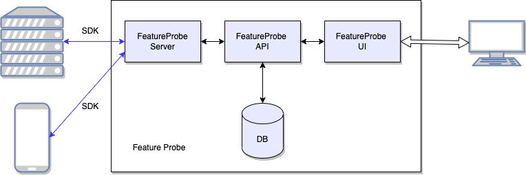

# 部署生产环境

本文档介绍如何部署 FeatureProbe 服务。

## 对比两种部署模式

FeatureProbe 服务架构如下图：


FeatureProbe 支持两种部署模式，可根据实际场景选择对应模式：

- All-in-One 部署：一般用于本地测试或试用，将所有子服务部署在一个部署单元中（容器、虚拟机、物理机），部署步骤简单。
- 子服务独立部署：适用于真实线上环境部署，子服务部署在单独部署单元中，部署过程稍复杂，灵活性更高，可以子服务单独扩容。

## 环境准备

* Docker 17+
* MySQL 5.7+
* 建议：生产环境3个节点及以上
* 建议：2核 CPU/4G内存及以上

## All-in-One 部署

使用 docker-compose快速在 Linux/Unix/Mac 上运行。

**操作步骤：**

1. 安装 git 和 docker
2. 国内默认链接从docker网站下载会比较慢，请先[配置国内docker镜像](https://gitee.com/featureprobe/FeatureProbe/blob/main/DOCKER_HUB.md)
3. 然后从github clone当前代码目录，按照以下命令启动服务：
   ```shell
   git clone https://gitee.com/featureprobe/FeatureProbe.git
   cd FeatureProbe
   docker compose up
   ```
4. docker启动成功后，打开浏览器，访问：`localhost:4009`，并用以下默认帐号登录试用：
   - username: `admin`
   - password: `Pass1234`

## 子服务独立部署

使用各模块提供的 [docker 镜象](https://hub.docker.com/repository/docker/featureprobe)在 Linux/Unix 独立部署。
需要部署有三个服务镜像，分别是 FeatureProbe UI、FeatureProbe Server 和 FeatureProbe API。
数据库可以使用默认的mysql镜像，也可以配置为链接已有的mysql数据库实例。

**操作步骤：**

1. 创建一个专用网络连接：
   ```bash
   docker network create featureProbeNet
   ```

2. 运行 MySQL 数据库实例:
  :::tip
  可以跳过此步骤，使用您已经部署好的其他MySQL环境。需要参考 [*数据库配置*](https://mariadb.com/kb/en/mariadb-docker-environment-variables/) 修改数据库连接信息，连接到您已部署好的MySQL实例。
  :::

   ```bash
   docker run -p 13306:13306 \
     -e MYSQL_TCP_PORT=13306 \
     -e MYSQL_ROOT_PASSWORD=root \
   	-e MYSQL_DATABASE=feature_probe \
     --network featureProbeNet --name database -d mariadb
   ```

3. 运行 FeatureProbe API 实例:
   ```bash
   docker run -p 4008:4008 \
      -e server.port=4008 \
      -e spring.datasource.jdbc-url=jdbc:mysql://{DatabaseIP:PORT}/{DATABASE_NAME} \
      -e spring.datasource.username=root \
      -e spring.datasource.password=root \
      --network featureProbeNet --name featureProbeAPI -d featureprobe/api
   ```

   *详情见 [FeatureProbe API 参数说明文档](deployment-configuration#FeatureProbe-API)*

4. 运行 FeatureProbe Server 实例:

   ```bash
   docker run -p 4007:4007 \
     -e FP_SERVER_PORT=4007 \
     -e FP_TOGGLES_URL=http://{FeatureProbeAPI:PORT}/api/server/toggles \
     -e FP_EVENTS_URL=http://{FeatureProbeAPI:PORT}/api/server/events \
     -e FP_KEYS_URL=http://{FeatureProbeAPI:PORT}/api/server/sdk_keys \
     --network featureProbeNet --name featureProbeServer -d featureprobe/server
   ```

   *详情见 [FeatureProbe Server 参数说明文档](deployment-configuration#FeatureProbe-Server)*

5. 运行 FeatureProbe UI 实例:

   ```bash
   docker run -p 4009:4009 \
   -v /my_custom/default.conf:/etc/nginx/conf.d/default.conf \
   --network featureProbeNet --name featureProbeUI -d featureprobe/ui 
   ```

   为保证 API 和 UI 端口一致(避免请求跨域)，需要自定义 nginx 配置转发 API 请求，`/my_custom/default.conf` 配置如下示例：

   ```nginx
   upstream featureProbeAPI {
       server 127.0.0.1:4008; # FeatureProbeAPI IP和端口
   }
   
   server {
     listen 4009;  # UI 端口
   
     location / {
       index  index.html index.htm;
       root /usr/share/nginx/html;
       try_files $uri /index.html;
     }
   
      location /api { # 访问 /api 时统一转发到 featureProbeAPI 服务
       proxy_set_header X-Real-IP $remote_addr;
       proxy_set_header X-Forwarded-For $proxy_add_x_forwarded_for;
       proxy_set_header X-NginX-Proxy true;
       proxy_pass http://featureProbeAPI/api;
       proxy_ssl_session_reuse off;
       proxy_set_header Host $http_host;
       proxy_cache_bypass $http_upgrade;
       proxy_redirect off;
     }
   }
   ```

6. 上述服务启动后打开浏览器，访问：`http://{FeatureProbeUI_IP:PORT}`并用以下默认帐号登录试用：

   - username: `admin`
   - password: `Pass1234`
