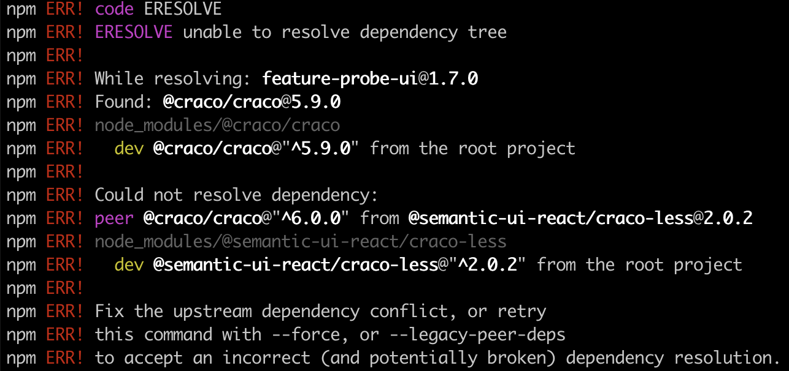

# feature-probe-ui

## 环境要求

[Node.js](https://nodejs.org/en/download/) 16.13及以上的版本（可通过执行`node -v`来查看当前的Node.js的版本）。您可以使用[nvm](https://github.com/nvm-sh/nvm)来管理多个Node版本。

### 安装


```shell
git clone https://github.com/FeatureProbe/feature-probe-ui.git
cd feature-probe-ui
yarn install
```

:::tip
强烈建议使用`yarn`作为包管理器。如果你正在使用`npm install`进行安装并遇到以下报错，请使用`npm install——legacy-peer-deps`命令代替。
:::



```shell
npm install --legacy-peer-deps
```

### 本地开发

```
yarn start
```

该命令启动一个本地开发服务器并打开一个浏览器窗口，默认端口为3000。访问 `http://localhost:3000` 来查看UI项目。


### 代理API请求

通过在`package.json`文件中添加一个`proxy`字段，你可以在开发环境将所有的请求代理到目标API服务。

```
"proxy": "https://featureprobe.io/"
```

源码里内置的`proxy`字段是我们的开源demo服务：`https://featureprobe.io/`，如果你私有化部署了自己的API服务，将`proxy`字段的值替换成自己的服务地址即可。


### 私有化部署

如果你想单独私有化部署UI项目，参考这片文档: [UI Service](../deploy/deployment-source-code#编译部署 UI 服务