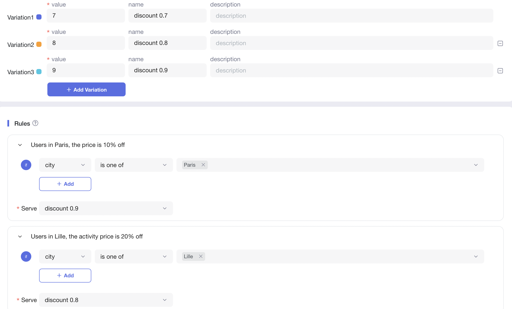
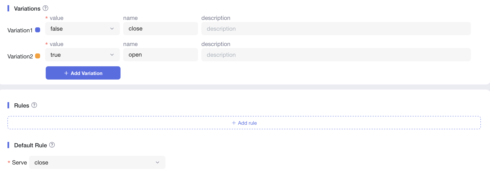
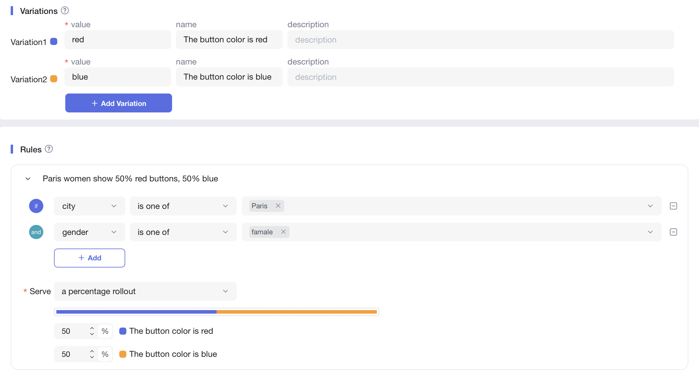

# 适用场景
FeatureProbe最常见的应用场景是新功能的发布或新版本的发布。当我们发布一个新功能或更新服务时，我们可以先为一小部分用户启用这些功能，而不影响大多数用户，确保降低发布的风险。
如果这些用户在使用中没有问题，我们就可以向更多的用户开放新版本，重复这个过程，直到所有的用户都更新到最新版本。

我们还有很多其他的场景也可以使用FeatureProbe。
### 在线促销活动
许多公司定期开展促销活动。这些活动在大多数情况下使用类似的模板，运营团队只需要修改几个参数就可以创建一个新的促销活动。
- 使用案例。运营人员想在"My First Project"项目下推出商品秒杀活动，需要根据不同城市设置不同的商品价格，以往都是需要通过开发在代码中写好，一旦价格需要变动，开发人员要在代码中修改线上商品价格，在经过审核部署发布等一些列操作，才能生效，使用FeatureProbe的功能开关，只需要运营人员修改一下“价格”，便可一秒发布生效。
- 操作流程

   + 流程说明
     * 运营人员在FeatureProbe上新增项目"My First Project"，并在项目的"online"环境下创建一个名叫"Promotional Campaign"的开关，开关配置如下图所示:
     
     * 开发人员在代码中引用FeatureProbe的sdk，配置"online"的密钥，并关联开关的key（promotion_activity），设置number类型的variations（用户价格分层）对应好定义的参数city
  
    ```java
   FPUser user = new FPUser(user_id);
   user.with("city", city_name);
   double discount = fpClient.numberValue("promotion_activity", user, 1.0);
   discountSetTo(discount);
    ```
 
     * 在一切准备就绪后，运营人员直接把"Promotional Campaign"开关"启用"，配置内容便即刻生效了
     * 价格需要变动的情况下，运营人员只需要直接修改variations中的价格，并分发给对应的人群即可

### 服务降级预案
当在线服务遇到非常高的需求，影响到一些依赖性服务或出现问题时（例如，一个后端服务意外地无法访问），我们需要通过使用缓存数据而不是从这些问题服务中获取数据来保证基本服务不受干扰地继续工作。

- 使用案例。电商服务需要调用一个库存备货服务来显示产品的库存信息。如果库存服务遇到一些问题而无法使用，运营团队可以利用FeatureProbe来进行以下操作在一秒钟内从缓存内容中获取库存数据，并进行时间成本较高的应用程序回退操作，或者在不中断在线服务的情况下切换到备份服务。

- 操作流程

   + 流程说明
     * 开发人员在项目My First Project"的"online"环境下创建一个名叫"Service Degrade"的开关，开关配置如下图所示:
     
     * 开发人员在代码中关联开关的key（service_degrade），设置boolean类型的variations（是否打开降级）
  
    ```java
   FPUser user = new FPUser(user_id);
    boolean fallback = fpClient.boolValue("service_degrade", user, false);
    if (fallback) {
    	// Do something.
    } else {
    	// Do normal process.
    }
    ```
 
     * 当依赖的库存服务发生故障后，为避免对用户造成影响，可以快速将库存服务进行降级，使用缓存非实时库存数据。
### A/B 实验
为一项具体的服务设计几个解决方案，全部尝试，找出最理想/最受欢迎的方案。
- 使用案例：某平台的支付按钮的颜色想由红色改为了绿色，产品小王不缺定哪个颜色效果更好，于是想使用FeatureProbe的功能开关，针对这两种颜色对巴黎的用户做个实验，看到底哪个颜色购买率更高
- 操作流程
   + 流程说明
     * 运营人员在项目My First Project"的"online"环境下创建一个名叫"Button Color AB Test"的开关，开关配置如下图所示:
     
     * 开发人员在代码中关联开关的key（color_ab_test），设置string类型的variations（颜色分类）对应好定义的参数city
  
    ```java
   FPUser user = new FPUser(user_id);
    user.with("city", city_name);
    String color = fpClient.stringValue("color_ab_test", user, "red");
    setButtonColor(color);
    ```
 
     * 在一切准备就绪后，运营人员直接把"Button Color AB Test"开关"启用"，配置内容便即刻生效了
     * 产品小王通过查看实验数据得出，支付按钮为绿色购买率会更高，于是全量用户开放为绿色
