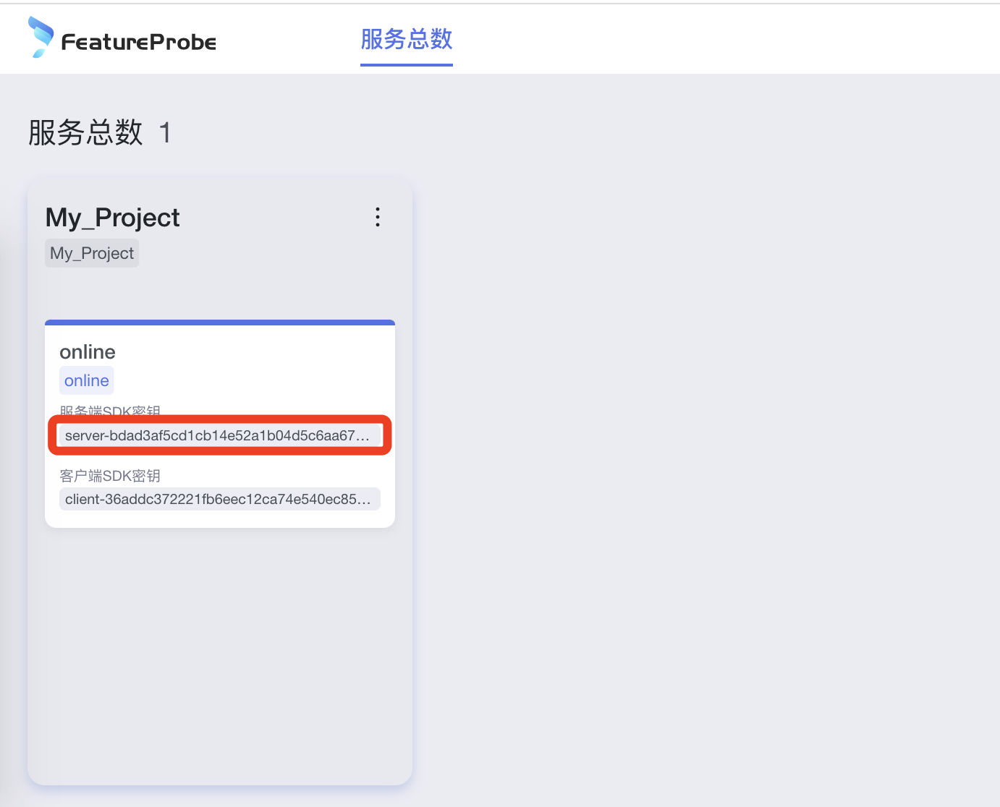

# Java SDK

使用此SDK可以在后端Java项目中使用FeatureProbe。后端项目通常只需要实例化一个FeatureProbe SDK（Client）。
然后针对不同用户的请求，调用FeatureProbe Client获取对每一个用户的开关处理结果。

服务端SDK采用异步连接FeatureProbe服务器，并将判定规则在本地内存缓存的实现方式。所有对用户代码暴露的接口都只涉及内存操作，用户完全不必担心性能问题。

## 快速尝试 Demo Code

我们提供了一个可运行的[演示代码](https://gitee.com/featureprobe/server-sdk-java/blob/main/src/main/java/com/featureprobe/sdk/example/FeatureProbeDemo.java)，让您了解如何使用 FeatureProbe SDK。

1. 首先需要选择通过连接哪个环境的FeatureProbe来控制你的程序
    * 可以使用我们提供的在线的[演示环境](https://featureprobe.io/login)
    * 也可以使用自己搭建的[docker环境](https://gitee.com/featureprobe/FeatureProbe#%E5%90%AF%E5%8A%A8featureprobe)

2. 下载演示代码：
```bash
git clone https://github.com/FeatureProbe/server-sdk-java.git
cd server-sdk-java
```

3. 修改演示代码`src/main/java/com/featureprobe/sdk/example/FeatureProbeDemo.java` 把 `FEATURE_PROBE_SERVER_URL` 和
    `FEATURE_PROBE_SERVER_SDK_KEY` 配置成你选择的FeatureProbe环境信息.

    * 对于在线演示环境:
        * `FEATURE_PROBE_SERVER_URL` = "https://featureprobe.io/server"
        * `FEATURE_PROBE_SERVER_SDK_KEY` please copy from GUI:
          
    * 对于本地docker环境:
        * `FEATURE_PROBE_SERVER_URLl` = "http://YOUR_DOCKER_IP:4009/server"
        * `FEATURE_PROBE_SERVER_SDK_KEY` = "server-8ed48815ef044428826787e9a238b9c6a479f98c"

4. 运行修改后的代码，查看程序输出
```bash
mvn package
java -jar ./target/server-sdk-java-1.3.0.jar
```

## 接入指南

以下将介绍如何在用户工程代码中使用 FeatureProbe 与功能开关。

### 步骤 1. 安装 FeatureProbe SDK

首先，在您的应用程序中安装 FeatureProbe SDK 作为依赖项。

#### Apache Maven

```xml
<dependency>
    <groupId>com.featureprobe</groupId>
    <artifactId>server-sdk-java</artifactId>
    <version>1.3.0</version>
</dependency>
```

#### Gradle Groovy DSL

```text
implementation 'com.featureprobe:server-sdk-java:1.3.0'
```

### 步骤 2. 创建一个 FeatureProbe instance

安装并导入 SDK 后，创建 FeatureProbe sdk 的单个共享实例。

```java
public class Demo {
    private static final FPConfig config = FPConfig.builder()
        .remoteUri(/* FeatureProbe Server URI */)
        .build();

    private static final FeatureProbe fpClient = new FeatureProbe(
        /* FeatureProbe Server SDK Key */, config);
}
```

### 步骤 3. 使用 FeatureProbe 开关获取设置的值

您可以使用 sdk 拿到对应开关名设置的值。

```java
FPUser user = new FPUser(/* uniqueUserId for percentage rollout */);
    user.with("ATTRIBUTE_NAME_IN_RULE", VALUE_OF_ATTRIBUTE);    // Call with() for each attribute used in Rule.
    boolean boolValue = fpClient.boolValue("YOUR_TOGGLE_KEY", user, false);
    if (boolValue) {
    // the code to run if the toggle is on
    } else {
    // the code to run if the toggle is off
    }
```

## SDK回归测试

我们对所有 SDK 进行了统一的集成测试。集成测试用例作为每个 SDK 存储库的子模块添加。所以
在运行测试之前，请务必先拉取子模块以获取最新的集成测试。

```shell
git pull --recurse-submodules
mvn test
```

## 在单元测试中 Mock FeatureProbe SDK

You can mock FeatureProbe SDK returned value, to run unittest of your code.

### 1. Add powermock SDK to your project:

```xml
<dependency>
    <groupId>org.powermock</groupId>
    <artifactId>powermock-api-mockito2</artifactId>
    <version>2.0.9</version>
    <scope>test</scope>
</dependency>
<dependency>
    <groupId>org.powermock</groupId>
    <artifactId>powermock-module-junit4</artifactId>
    <version>2.0.9</version>
    <scope>test</scope>
</dependency>
```

### 2. Mock Toggle

#### Target Method

```java
@AllArgsConstructor
@Service
public class DemoService {

    FeatureProbe fp;

    public boolean isTester(String userId, String tel) {
        FPUser fpUser = new FPUser(userId);
        fpUser.with("tel", tel);
        return fp.boolValue("is_tester", fpUser, false);
    }
}
```
#### Unit Test Code

```java
@RunWith(PowerMockRunner.class)
@PrepareForTest({FeatureProbe.class})
public class FeatureProbeTest {

    @Test
    public void test() {
        FeatureProbe fp = PowerMockito.mock(FeatureProbe.class);
        DemoService demoService = new DemoService(fp);
        Mockito.when(fp.boolValue(anyString(), any(FPUser.class), anyBoolean())).thenReturn(true);
        boolean tester = demoService.isTester("user123", "12397347232");
        assert tester;
    }

}
```
